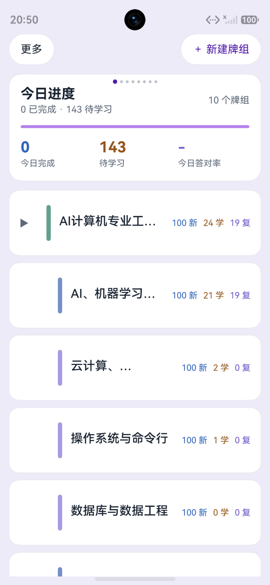
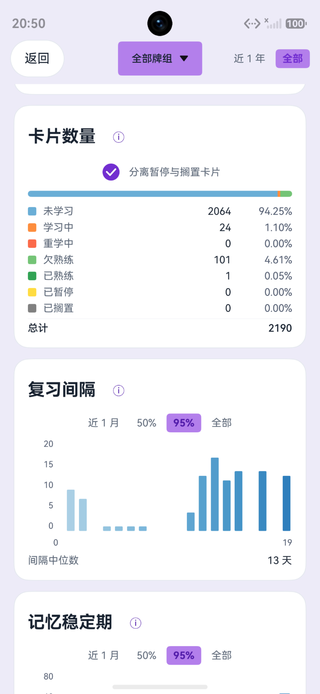
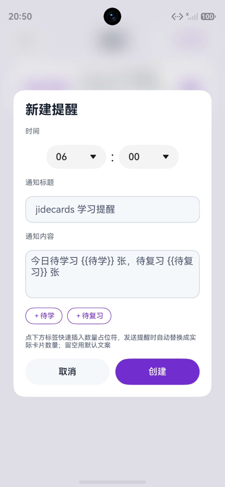
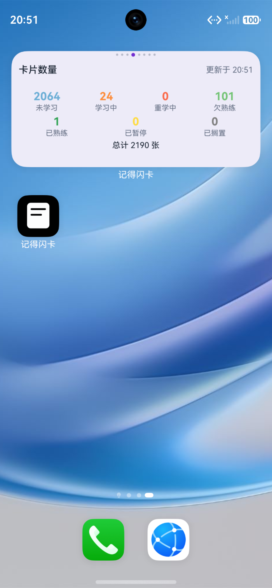

# jidecards

jidecards 是一个基于 HarmonyOS 的 Anki 卡片学习客户端，复用 Anki 的 Rust 后端。最新正式版可在华为应用市场（AppGallery）搜索"记得闪卡"下载安装。

本项目与 Ankitects、AnkiWeb、AnkiDroid 无关，也未获得其认可。

## 应用截图

<p align="center">
  
  
  
  
</p>

## 功能特性

### jidecards 额外实现

在 Anki 核心功能之外，jidecards 额外实现了以下特性：

- **牌组背景自定义**：从系统图库选取图片，通过 IBestImageCropper 裁剪后以 JPEG（quality=85）保存到本地沙箱，路径写入 preferences 持久化。支持替换与清除，切换背景时自动清理旧文件。
- **6 种颜色主题**：aurora / forest / midnight / lagoon / sunset / lemon。选定主色后基于 HSV 色彩空间自动派生完整色阶（hover / pressed / container 等语义色），支持全局热切换，无需重启。
- **热力图月历**：4 级热力色（热力1 ~ 热力4）渲染每日学习强度，支持折叠/展开切换，"今天"日期加粗高亮。
- **浮动学习工具栏**：学习页工具栏支持 `bottom`（底部固定）与 `float`（浮动）两种模式。浮动模式下可拖动到屏幕任意位置，松手后自动吸附到最近的屏幕边缘，位置持久化。
- **HarmonyOS 原生 TTS**：基于 `@kit.CoreSpeechKit`，支持队列播放、重播、停止、释放。按语种（en / zh 等）选择音色人物，引擎缓存（语种 + 人物 + 语音版本号命中即复用），播放失败自动前进到下一项。
- **好评引导**：优先调用 `@kit.AppGalleryKit` 的 `commentManager.showCommentDialog` 弹出华为应用内评价对话框；失败时回退 DeepLink（`store://appgallery.huawei.com/app/detail?id=...`）跳转应用市场详情页。
- **中英双语界面**：内置中文 / English 切换，语言偏好持久化，资源文件在 `entry/src/main/resources/en_US`。
- **ArkUI 原生体验**：基于 ArkUI 声明式 UI 构建，非 WebView / 跨平台方案，保证 HarmonyOS 原生渲染性能与交互体验。

#### 浏览模式（浏览器）

- **多条件搜索**：按牌组 / 标签 / 已保存搜索过滤，左侧树形侧边栏展示节点，长按节点可切换 AND / OR 追加语义；搜索串由 Anki 后端生成，前端不拼接。
- **卡片表格**：Question + Deck + Due 三列（长按表头可配置列），支持多选、空态、行数据懒加载；行点击弹出浏览编辑区，直接编辑笔记字段与标签。
- **查找替换**：在搜索结果中查找并批量替换文本，支持区分大小写与正则匹配。
- **批量操作**：对选中的卡片批量执行埋藏 / 暂停 / 删除 / 添加标签等操作，操作后可撤销。
- **卡片预览**：Web 组件复用卡片渲染服务，实时预览任意卡片；支持翻面、左右滑动切换上 / 下张，底部"编辑字段"直达浏览编辑区。

#### 统计

- **11 张图表**：预测、复习、新增、卡片数量、复习间隔、卡片难度、记忆保留率、逐小时分析、回答按钮、卡片稳定度、卡片可提取性，覆盖 FSRS 学习各维度；图表用纯 ArkUI（Text / Column / Row / Stack）绘制，不依赖第三方图表库，配色与口径对齐 Anki 官方。
- **范围切换**：各图支持近 1 月 / 3 月 / 1 年 / 全部或 50% / 95% 分位截断，顶栏提供全局「近 1 年 / 全部」时间范围，记忆保留率支持欠熟练 / 已熟练 / 汇总三视图。
- **偏好即时保存**：偏好控件内嵌各图表（如分离暂停与搁置卡片、日历周首日），修改即落库。
- **三处一致**：统计页、主页摘要卡、桌面卡片共享同一数据口径与配色。

#### 媒体管理

- **媒体体检**：一键检查 media 目录，列出未被引用的孤儿文件、被引用但缺失的文件及缺失媒体的笔记。
- **回收站机制**：支持将文件移入 / 恢复 / 清空回收站，清空需二次确认（永久删除，不可恢复）。

#### 标签管理

- 浏览侧边栏树形展示全部标签，长按弹出操作菜单：追加搜索、重命名、删除、补全。

### Anki 核心功能

复用 Anki rslib（Rust）后端，通过 C ABI + Node-API 桥接到 ArkTS，完整支持：

- **FSRS 间隔重复调度**：首次启动自动开启 FSRS 并触发重调度，支持开关切换。
- **AnkiWeb 同步**：完整封装登录 / 状态检查 / 集合同步 / 全量上传下载 / 媒体同步 / 中止同步，支持自定义 TLS 证书（兼容自建 AnkiWeb 服务端）。
- **图片遮罩笔记（Image Occlusion）**：在 Canvas 上以归一化坐标拖拽创建矩形遮罩，支持 1-5 编号选中、命中检测、移动已有遮罩。卡片渲染时内嵌 JS 脚本绘制遮罩并支持隐藏/显示切换。
- **拼写填空（Cloze）**：解析 `{{c1::内容::提示}}` 语法，支持多编号（逗号分隔）、嵌套、提示文本。比对用户输入与答案，剥离 HTML 标签与 `[sound:...]` / `[anki:tts]` 指令后高亮正确 / 错误 / 遗漏部分。
- **数据导入导出**：支持 `.apkg` / `.anki2` 牌组与集合的导入导出，可携带调度、牌组配置与媒体文件，含二次确认机制。
- **卡片埋藏 / 暂停 / 撤销**：完整支持单卡与牌组级别的埋藏、暂停、恢复，以及多步撤销操作。
- **学习统计**：调用 rslib `GraphsView` 接口获取图表统计，映射为每日热力强度与完成页信息，并在统计页以 11 张图表可视化呈现。

## 技术栈

- 前端：ArkTS / ArkUI（HarmonyOS）
- 后端：Anki rslib（Rust，通过 C ABI + Node-API 桥接）
- 许可证：AGPL-3.0-or-later

## 构建要求

- DevEco Studio + HarmonyOS SDK
- Rust 1.92.0（见 rust-toolchain.toml）
- protoc、cargo-zigbuild、zig

## 获取 Anki 源码

本项目的 Rust 后端依赖 Anki rslib。构建前需将 Anki 源码放置到 `third_party/anki/`：

```bash
git clone https://github.com/ankitects/anki.git third_party/anki
```

Anki rslib 版权归 Ankitects Pty Ltd 所有，采用 AGPL-3.0-or-later 许可。

## 构建

```bash
ohpm install
npm run doctor
npm run build:app
```

测试：`npm test`
